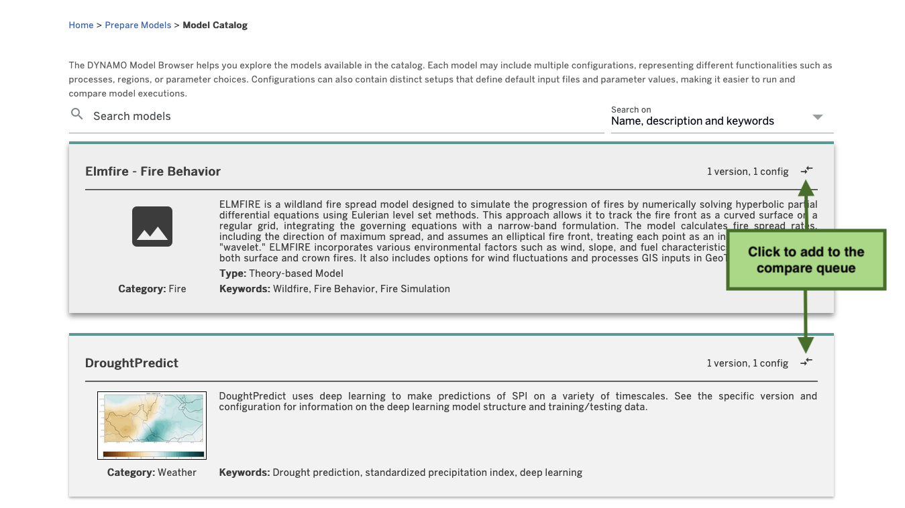
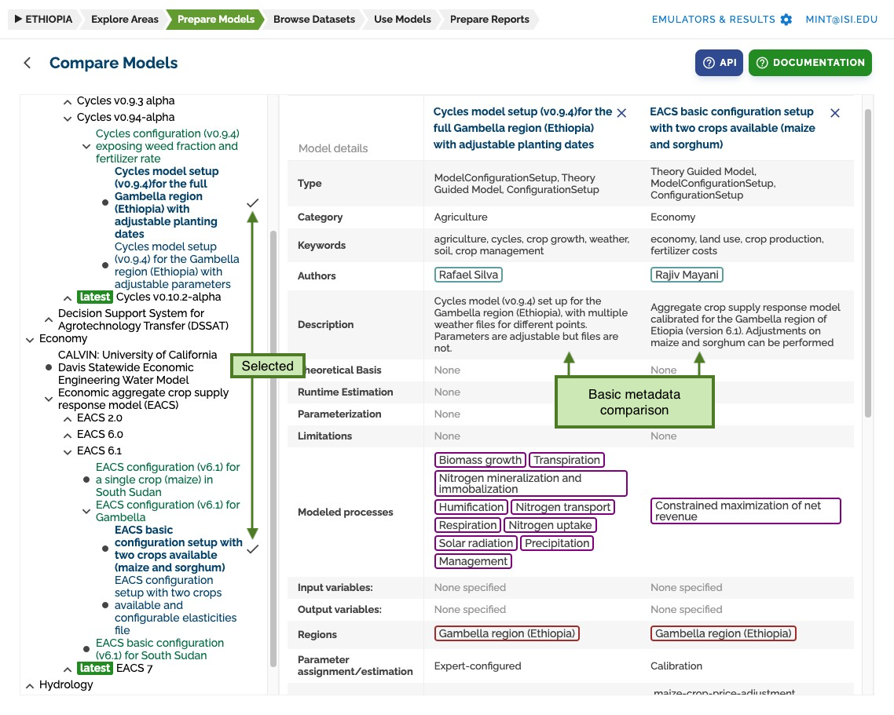
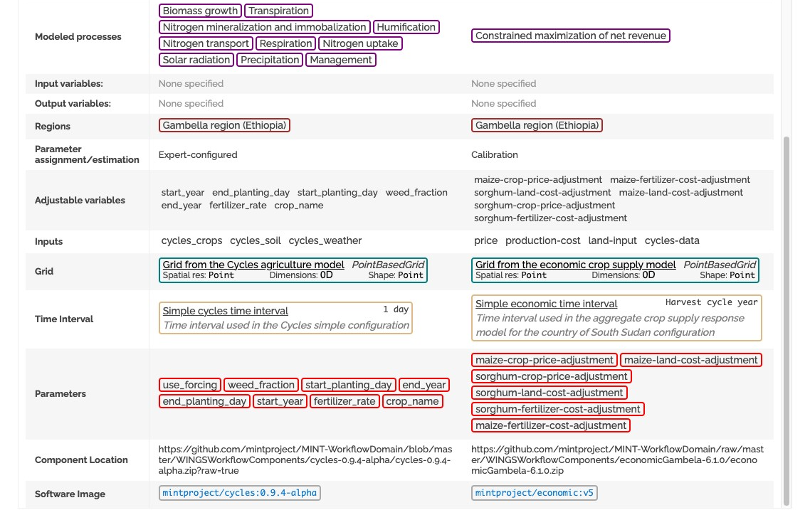

# Compare Models

To compare models, go to the **Browse models** section and click on two or more models to compare. Models are added to the compare queue.

## Model Comparison Interface

A list of all models, versions, configurations, and setups of the DYNAMO model catalog will be shown on the left.
Clicking on their names will add them to the comparison table.

## Setup Comparison

You can compare setup specific data too:

