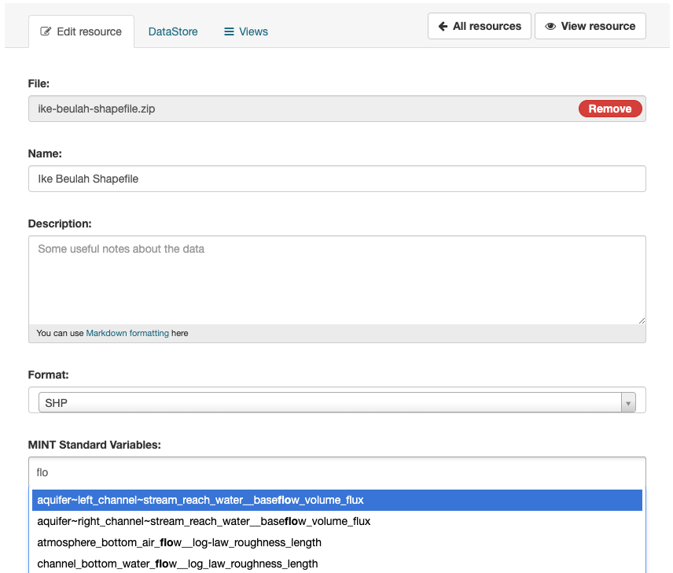

# Prepare Data: CKAN

This guide explains how to add data to DYNAMO using CKAN.

## Adding Data via CKAN

CKAN is an open-source data management system that can be used to host and share datasets. When adding data to DYNAMO via CKAN, there are two important requirements:

### 1. Spatial Coverage

Each dataset must include a spatial coverage field. This is typically a GeoJSON object describing the geographic area covered by the dataset. For example:

```json
{
  "type": "Polygon",
  "coordinates": [
    [
      [-98.0, 30.3],
      [-97.5255, 30.3],
      [-97.5255, 30.155],
      [-98.0, 30.155],
      [-98.0, 30.3]
    ]
  ]
}
```

This field ensures that the dataset can be properly indexed and discovered based on its geographic relevance.

### 2. DYNAMO Standard Variables

Each resource in the dataset must specify at least one DYNAMO Standard Variable. These are standardized variable names used within the DYNAMO platform to ensure interoperability and consistency across datasets. For example:

```
groundwater__initial_head
```

You can select from the list of standard variables provided in the DYNAMO interface. This step is required for the dataset to be usable in DYNAMO workflows.



## Implementation Steps

1. Set up your CKAN instance
2. Create a new dataset
3. Add the required spatial coverage field
4. Add resources and specify DYNAMO Standard Variables
5. Publish the dataset

For more information, refer to the [list of standard variables](https://mint.tacc.utexas.edu/variables) and the DYNAMO documentation.
